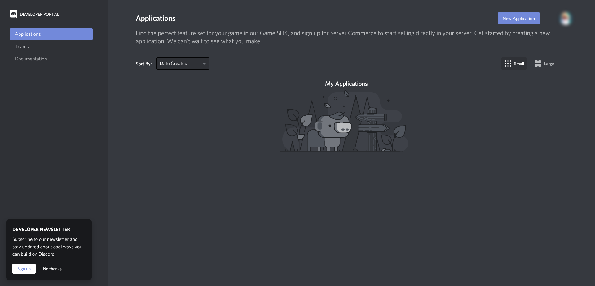
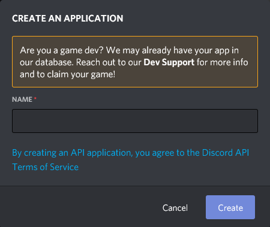
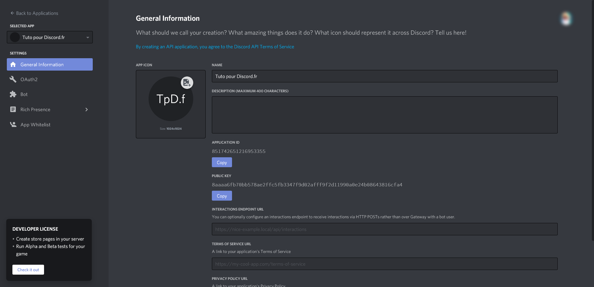
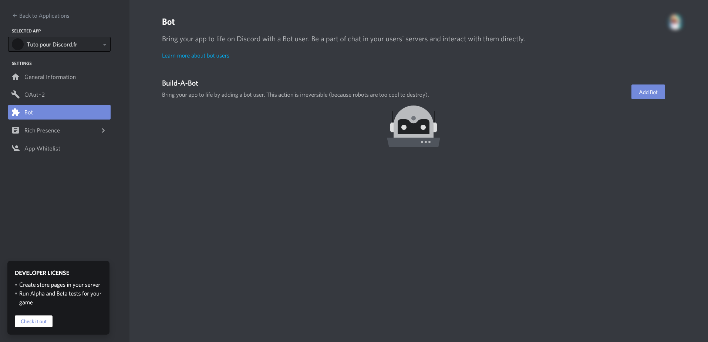

# Les robots
Les robots sont indispensables à la vie sur Discord. Sur presque chaque serveur, vous trouverez au moins un robot (qu'on appellera par la suite "bot"). Des bots dédiés à la modération, l'amusement ou encore l'expérience (niveaux). Les plus connus sont [MEE6](https://mee6.xyz/) (Modération-Notifications), [Dyno](https://dyno.gg/) (Multifonction), [Septapus](http://septapus.com) (Fun) et [Rythm](https://rythm.fm/) (Musique). Vous avez, vous aussi, envie de créer un bot? C'est parti, suivez moi dans les chemins sinueux du monde de l'API Discord.
## Étape 1 - Créer une application
Rendez-vous sur [cette page](https://discord.com/developers/applications), vous aurez un écran à peu près similaire à celui-ci :

- Sélectionnez le bouton "New Application".
- Renseignez les informations de l'application.
- 
- Vous pouvez ajouter une image de profil et une description à votre application.
- 
- Sélectionnez le menu "Bot" à gauche de la page.
- 
- Sélectionnez "Add Bot".
- Sélectionnez "Yes, do it!".
- Renseignez les informations voulues
- Rendez-vous sur [cette page](https://discordapi.com/permissions.html) pour inviter le bot (Copiez auparavant l'ID du client en allant sur la page de présentation de l'application) et insérez l'ID du bot dans la case prévue à cet effet.
- Sélectionnez les permissions requises et invitez le bot sur un serveur.
- Apprenez un langage de programmation, les plus utilisés pour les bots discord sont [`python`](https://www.youtube.com/playlist?list=PLMS9Cy4Enq5JmIZtKE5OHJCI3jZfpASbR) et [`javascript`](https://www.youtube.com/watch?v=PkZNo7MFNFg).
- Vous pouvez ensuite regarder des tutoriels pour faire des bots discord : [`python`](https://www.youtube.com/watch?v=SLd4d5EqbiM) et [`javascript`](https://www.youtube.com/watch?v=vpubCPHn5gY) ou naviguer avec les documentations des bibliothèques les plus utilisées : [`discord.py`](https://discordpy.readthedocs.io/en/stable/api.html) et [`discord.js`](https://discord.js.org/#/docs/main/stable/general/welcome)
- Bonne Chance !
